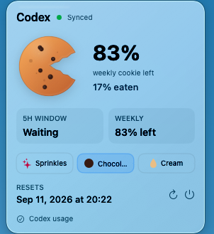

# CodexQuotaBar

A tiny native macOS menu bar app for watching Codex quota as a bitten cookie.

CodexQuotaBar shows your weekly Codex quota in the menu bar and opens a compact glass popover with more detail. The design idea is simple: your weekly quota is a cookie, and usage takes bites out of it.



## Features

- Native macOS menu bar app.
- Weekly quota shown as a small bitten-cookie silhouette.
- Compact liquid-glass popover.
- Larger cookie illustration with a usage-based bite.
- 5h and weekly quota window display.
- Reset time, sync status, refresh, and quit controls.
- Saved topping styles: sprinkles, chocolate, and cream.
- Automatic refresh every 60 seconds.

## Data source

The app reads your local Codex login file:

```text
~/.codex/auth.json
```

If `CODEX_HOME` is set, it reads:

```text
$CODEX_HOME/auth.json
```

It uses the local access token and account id to request:

```text
https://chatgpt.com/backend-api/wham/usage
```

This is an unofficial local Codex integration inspired by quota-float. The token is used only as an Authorization header for the Codex usage request.

For more detail, read [PRIVACY.md](PRIVACY.md).

## Build and run

Open the project in Xcode:

```text
CodexQuotaBar.xcodeproj
```

Select the `CodexQuotaBar` scheme, then press Run.

The app requires macOS 14 or later.

## Probe usage sync

To check whether the Codex usage request works outside Xcode:

```bash
node Scripts/probe-codex-usage.mjs
```

The probe prints usage percentages only. It must not print tokens.

## Build an app bundle

First make the build script executable:

```bash
chmod +x Scripts/build-app.sh
```

Then build:

```bash
Scripts/build-app.sh
```

The app bundle is created at:

```text
outputs/CodexQuotaBar.app
```

## Local fallback data

If live sync fails, the app can read fallback data from:

```text
~/Library/Application Support/CodexQuotaBar/usage.json
```

Expected JSON:

```json
{
  "weeklyWindow": {
    "usedPercent": 49,
    "resetAt": "2026-10-04T10:24:53Z",
    "windowMinutes": 10080
  },
  "shortWindow": {
    "usedPercent": 18,
    "resetAt": "2026-09-04T23:30:00Z",
    "windowMinutes": 300
  },
  "tokensUsed": 128400,
  "updatedAt": "2026-09-04T05:42:00Z"
}
```

If live sync and fallback data are both unavailable, the app displays sample data while keeping the sync error visible.

## Release status

This project is pre-release. Before publishing, see [RELEASE_CHECKLIST.md](RELEASE_CHECKLIST.md).

## License

MIT. See [LICENSE](LICENSE).
